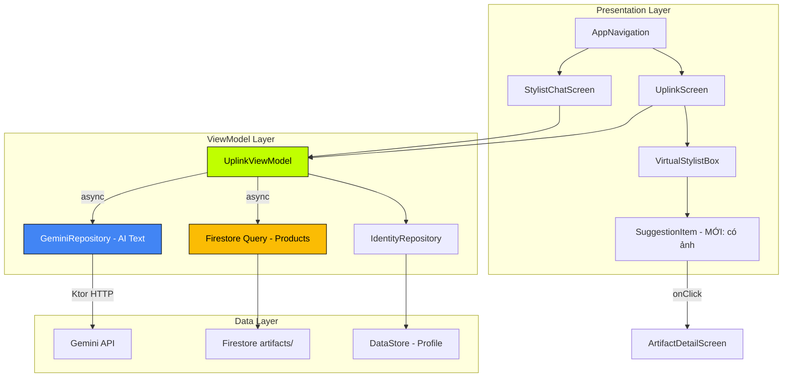

# 🤖 VIRTUAL STYLIST BOX — Tài Liệu Triển Khai V2

> Hướng dẫn tích hợp **Gemini API + Firestore** để hiển thị sản phẩm gợi ý thông minh.

---

## 1. Tổng Quan Hệ Thống

Virtual Stylist Box kết hợp **2 nguồn dữ liệu**:
- **Gemini API** → Sinh câu trả lời tự nhiên, phân tích ngữ cảnh user
- **Firestore** → Kéo sản phẩm thật từ `artifacts/` collection theo archetype + category

### Luồng Xử Lý Mong Muốn (MỚI)

```
User gửi "Gợi ý giày cho tôi"
    ↓
1. Lưu tin nhắn → _chatMessages
    ↓
2. State → ANALYZE (hiệu ứng sóng)
    ↓
3. SONG SONG:
   ├─ [A] Gemini API → Sinh text phân tích phong cách
   └─ [B] Firestore  → Query artifacts/ theo archetype + category
    ↓
4. Kết hợp: Gemini text + Firestore products
    ↓
5. State → SUGGEST (hiển thị text AI + card sản phẩm)
```

### So Sánh: Hiện Tại vs Mới

| Khía Cạnh | Hiện Tại (Local AI) | Mới (Gemini + Firestore) |
|---|---|---|
| Text Response | Rule-based keyword matching | Gemini `gemini-2.0-flash-lite` |
| Product Query | Firestore (đã có) | Firestore (giữ nguyên) |
| Ngôn ngữ | Cứng, template | Tự nhiên, editorial tone |
| Category Detection | `contains("giày")` hardcode | Gemini phân tích → extract category |
| Error Handling | Không có | Retry 3 lần + fallback local |

---

## 2. Tất Cả File Liên Quan

### 📁 Cần SỬA (MODIFY)

| # | File | Vai Trò | Thay Đổi |
|---|---|---|---|
| 1 | `presentation/uplink/UplinkViewModel.kt` | Logic trung tâm | Thêm GeminiRepository, refactor `sendMessage()` |
| 2 | `presentation/uplink/stylist/StylistState.kt` | State machine | Mở rộng `Suggestion` thêm `imageUrl`, `artifactId`, `price` |
| 3 | `presentation/uplink/stylist/VirtualStylistBox.kt` | UI chính | Cập nhật `SuggestionItem` hiển thị ảnh + nút navigate |
| 4 | `presentation/chat/StylistChatScreen.kt` | Chat terminal | Thêm hiển thị product card trong chat |
| 5 | `core/di/NetworkModule.kt` | DI Module | Đăng ký `GeminiRepository` (nếu chưa) |

### 📁 Giữ Nguyên (KHÔNG SỬA)

| # | File | Vai Trò |
|---|---|---|
| 6 | `data/repository/GeminiRepository.kt` | Gemini API client (đã hoàn chỉnh) |
| 7 | `data/repository/IdentityRepository.kt` | Lưu/load profile từ DataStore |
| 8 | `domain/model/Artifact.kt` | Model sản phẩm |
| 9 | `domain/model/ChatMessage.kt` | Model tin nhắn |
| 10 | `domain/model/Archetype.kt` | Enum 4 archetype |
| 11 | `domain/model/IdentityProfile.kt` | Profile người dùng |
| 12 | `presentation/navigation/AppNavigation.kt` | Route registration |

---

## 3. Chi Tiết Từng File Cần Sửa

### 3.1. `UplinkViewModel.kt` — THAY ĐỔI LỚN NHẤT

**Hiện tại (dòng 29-31):**
```kotlin
@HiltViewModel
class UplinkViewModel @Inject constructor(
    // ĐÃ GỠ BỎ GEMINI, CHỈ DÙNG IDENTITY REPOSITORY
    private val identityRepository: IdentityRepository
) : ViewModel()
```

**Cần sửa thành:**
```kotlin
@HiltViewModel
class UplinkViewModel @Inject constructor(
    private val identityRepository: IdentityRepository,
    private val geminiRepository: GeminiRepository  // ← THÊM LẠI
) : ViewModel()
```

**Refactor `sendMessage()` — Luồng mới:**

```kotlin
fun sendMessage(text: String) {
    if (text.isBlank()) return
    val currentProfile = _identityProfile.value ?: return
    if (_isProcessing.value) return

    viewModelScope.launch {
        try {
            _isProcessing.value = true

            // 1. Lưu tin nhắn User
            val userMsg = ChatMessage(text = text, isFromUser = true)
            _chatMessages.update { it + userMsg }
            delay(300L)

            // 2. Hiệu ứng ANALYZE
            _stylistState.value = StylistState.ANALYZE(userMessage = text)

            // 3. Kéo Body Data từ Firebase
            val (userHeight, userWeight) = fetchBodyData()

            // 4. GỌI SONG SONG: Gemini + Firestore
            val geminiDeferred = async {
                try {
                    geminiRepository.getStylistResponse(
                        userMessage = text,
                        profile = currentProfile,
                        conversationHistory = buildConversationHistory()
                    )
                } catch (e: Exception) {
                    // Fallback sang Local AI nếu Gemini fail
                    generateLocalAIResponse(
                        text.lowercase(), currentProfile, userHeight, userWeight
                    )
                }
            }

            val firestoreDeferred = async {
                fetchArtifactSuggestions(text, currentProfile)
            }

            val aiResponseText = geminiDeferred.await()
            val realSuggestions = firestoreDeferred.await()

            // 5. Lưu response vào chat
            val aiMsg = ChatMessage(text = aiResponseText, isFromUser = false)
            _chatMessages.update { it + aiMsg }

            // 6. Đẩy kết quả ra UI
            _stylistState.value = StylistState.SUGGEST(
                userMessage = text,
                systemResponse = aiResponseText,
                suggestions = realSuggestions
            )

        } catch (e: Exception) {
            showError("SYSTEM ERROR\n${e.message}")
        } finally {
            _isProcessing.value = false
        }
    }
}
```

**Thêm helper functions:**

```kotlin
// Tách logic kéo body data
private suspend fun fetchBodyData(): Pair<Float, Float> {
    val uid = auth.currentUser?.uid ?: return 0f to 0f
    return try {
        val doc = db.collection("users").document(uid).get().await()
        val bodyData = doc.get("bodyData") as? Map<String, String>
        val h = bodyData?.get("height")?.toFloatOrNull() ?: 0f
        val w = bodyData?.get("weight")?.toFloatOrNull() ?: 0f
        h to w
    } catch (e: Exception) { 0f to 0f }
}

// Tách logic query Firestore artifacts
private suspend fun fetchArtifactSuggestions(
    text: String, 
    profile: IdentityProfile
): List<Suggestion> {
    val lowerText = text.lowercase()
    val targetCategory = detectCategory(lowerText)
    
    // Chỉ query nếu user hỏi về sản phẩm
    val needsProducts = listOf("gợi ý", "tư vấn", "mặc", "tìm", "mua", "recommend")
        .any { lowerText.contains(it) }
    if (!needsProducts) return emptyList()

    return try {
        var query = db.collection("artifacts")
            .whereEqualTo("archetype", profile.dominantArchetype.name)
        
        if (targetCategory != null) {
            query = query.whereEqualTo("category", targetCategory)
        }

        query.limit(3).get().await().documents.map { doc ->
            Suggestion(
                title = doc.getString("title") ?: "CLASSIFIED ARTIFACT",
                description = doc.getString("price") ?: "",
                imageUrl = doc.getString("image") ?: "",
                artifactId = doc.id,
                price = doc.getString("price") ?: ""
            )
        }
    } catch (e: Exception) { emptyList() }
}

// Tách logic detect category
private fun detectCategory(text: String): String? = when {
    text.containsAny("giày", "sneaker", "boots", "shoe") -> "FOOTWEAR"
    text.containsAny("phụ kiện", "kính", "mũ", "balo", "túi") -> "ACCESSORY"
    text.containsAny("áo khoác", "jacket", "hoodie", "coat") -> "OUTERWEAR"
    text.containsAny("áo", "shirt", "tee", "top") -> "TOP"
    text.containsAny("quần", "pants", "shorts", "trousers") -> "BOTTOM"
    else -> null
}

private fun String.containsAny(vararg keywords: String) = 
    keywords.any { this.contains(it) }

// Build conversation history cho Gemini context
private fun buildConversationHistory(): List<Pair<String, String>> {
    val msgs = _chatMessages.value
    val pairs = mutableListOf<Pair<String, String>>()
    var i = 0
    while (i < msgs.size - 1) {
        if (msgs[i].isFromUser && !msgs[i + 1].isFromUser) {
            pairs.add(msgs[i].text to msgs[i + 1].text)
        }
        i++
    }
    return pairs.takeLast(3)
}
```

---

### 3.2. `StylistState.kt` — Mở Rộng Suggestion

**Hiện tại (dòng 70-73):**
```kotlin
data class Suggestion(
    val title: String,
    val description: String
)
```

**Cần sửa thành:**
```kotlin
data class Suggestion(
    val title: String,
    val description: String,
    val imageUrl: String = "",      // ← ẢNH SẢN PHẨM
    val artifactId: String = "",    // ← ID để navigate đến detail
    val price: String = ""          // ← GIÁ HIỂN THỊ
)
```

---

### 3.3. `VirtualStylistBox.kt` — Cập Nhật SuggestionItem

**Hiện tại (dòng 686-725):** `SuggestionItem` chỉ hiển thị text

**Cần sửa thành:** Hiển thị ảnh + thông tin + nút navigate

```kotlin
@Composable
fun SuggestionItem(
    suggestion: Suggestion,
    onNavigateToDetail: ((String) -> Unit)? = null  // ← THÊM
) {
    Row(
        modifier = Modifier
            .fillMaxWidth()
            .background(PhantomGrey.copy(alpha = 0.2f))
            .border(1.dp, GridLineColor.copy(alpha = 0.5f))
            .clickable { 
                if (suggestion.artifactId.isNotEmpty()) {
                    onNavigateToDetail?.invoke(suggestion.artifactId)
                }
            }
            .padding(16.dp),
        verticalAlignment = Alignment.Top,
        horizontalArrangement = Arrangement.spacedBy(12.dp)
    ) {
        // Ảnh sản phẩm (nếu có)
        if (suggestion.imageUrl.isNotEmpty()) {
            AsyncImage(
                model = suggestion.imageUrl,
                contentDescription = suggestion.title,
                modifier = Modifier
                    .size(64.dp)
                    .clip(RoundedCornerShape(4.dp)),
                contentScale = ContentScale.Crop
            )
        } else {
            Text("→", fontFamily = AppFonts.spaceMono, 
                 fontSize = 14.sp, color = CyberAcid)
        }

        Column(modifier = Modifier.weight(1f)) {
            Text(
                text = suggestion.title,
                fontFamily = AppFonts.oswald,
                fontSize = 15.sp,
                fontWeight = FontWeight.Bold,
                color = TeslaWhite
            )
            Spacer(modifier = Modifier.height(4.dp))
            if (suggestion.price.isNotEmpty()) {
                Text(
                    text = suggestion.price,
                    fontFamily = AppFonts.spaceMono,
                    fontSize = 12.sp,
                    color = CyberAcid
                )
            }
            Spacer(modifier = Modifier.height(4.dp))
            Text(
                text = "VIEW ARTIFACT →",
                fontFamily = AppFonts.spaceMono,
                fontSize = 9.sp,
                color = TechSilver.copy(alpha = 0.6f),
                letterSpacing = 1.sp
            )
        }
    }
}
```

> **Lưu ý:** Cần thêm dependency `coil-compose` cho `AsyncImage`:
> ```gradle
> implementation("io.coil-kt:coil-compose:2.6.0")
> ```

---

### 3.4. `NetworkModule.kt` — Đăng Ký GeminiRepository

**Kiểm tra:** `GeminiRepository` đã dùng `@Singleton` + `@Inject constructor()` → Hilt tự động inject, **KHÔNG cần sửa NetworkModule**.

Tuy nhiên, nếu gặp lỗi DI, thêm:
```kotlin
@Provides
@Singleton
fun provideGeminiRepository(): GeminiRepository = GeminiRepository()
```

---

### 3.5. `StylistChatScreen.kt` — Hiển Thị Product Card Trong Chat

**Thêm xử lý khi state = SUGGEST để hiển thị sản phẩm inline trong chat:**

Trong `ChatMessageItem`, thêm kiểm tra nếu message chứa suggestion data → render product cards bên dưới text.

*(Hoặc giữ nguyên nếu chỉ muốn hiển thị product ở VirtualStylistBox — tùy lựa chọn UX)*

---

## 4. GeminiRepository — Đã Có Sẵn

File `data/repository/GeminiRepository.kt` (441 dòng) đã hoàn chỉnh với:

| Feature | Chi Tiết |
|---|---|
| Model | `gemini-2.0-flash-lite` |
| HTTP Client | Ktor + Android engine |
| Rate Limiting | Min 1 giây giữa các request |
| Retry | 3 lần, exponential backoff |
| Error Classes | 6 loại `GeminiException` (InvalidApiKey, QuotaExceeded, ServerError, NetworkError, SafetyBlocked, EmptyResponse) |
| Non-retryable | InvalidApiKey, QuotaExceeded, SafetyBlocked → fail ngay |
| Fallback | `getIntelligentFallback()` trả offline response |
| Vietnamese | Auto-detect tiếng Việt |
| System Prompt | Tuỳ biến theo archetype (GHOST, OPERATOR, GLITCH, NOMAD) |
| API Key | `BuildConfig.GEMINI_API_KEY` từ `local.properties` |

### Cấu Hình API Key

```properties
# local.properties (KHÔNG commit lên git)
GEMINI_API_KEY=AIzaSy...your_key_here
```

```gradle
// build.gradle.kts (app)
android {
    defaultConfig {
        buildConfigField("String", "GEMINI_API_KEY", 
            "\"${project.findProperty("GEMINI_API_KEY") ?: ""}\"")
    }
}
```

---

## 5. Firestore Schema

### Collection: `artifacts/`

```
artifacts/
├── {docId}
│   ├── id: String          // "artifact_001"
│   ├── title: String       // "AIR FORCE 1 SHADOW"
│   ├── category: String    // "FOOTWEAR" | "TOP" | "BOTTOM" | "OUTERWEAR" | "ACCESSORY"
│   ├── archetype: String   // "GHOST" | "OPERATOR" | "GLITCH" | "NOMAD"
│   ├── price: String       // "$129.00"
│   ├── image: String       // "https://..."
│   ├── isVideo: Boolean
│   ├── commissionRate: Double
│   ├── isDirectSale: Boolean
│   ├── internalPrice: Double?
│   └── stock: Int?
```

### Collection: `users/{uid}`

```
users/
├── {uid}
│   ├── bodyData: Map
│   │   ├── height: String  // "175"
│   │   └── weight: String  // "68"
│   └── ...
```

### Firestore Indexes Cần Tạo

```
Collection: artifacts
Fields: archetype ASC, category ASC
```

---

## 6. Sequence Diagram

```
┌──────┐     ┌───────────────┐     ┌────────┐     ┌───────────┐
│ User │     │UplinkViewModel│     │ Gemini │     │ Firestore │
└──┬───┘     └──────┬────────┘     └───┬────┘     └─────┬─────┘
   │                │                   │                │
   │ "Gợi ý giày"  │                   │                │
   │───────────────>│                   │                │
   │                │                   │                │
   │                │ [State=ANALYZE]   │                │
   │                │──────┐            │                │
   │                │      │ delay      │                │
   │                │<─────┘            │                │
   │                │                   │                │
   │                │ getStylistResponse│                │
   │                │──────────────────>│                │
   │                │                   │                │
   │                │ query artifacts/  │                │
   │                │───────────────────────────────────>│
   │                │                   │                │
   │                │   AI text response│                │
   │                │<──────────────────│                │
   │                │                   │                │
   │                │   List<Artifact>  │                │
   │                │<──────────────────────────────────│
   │                │                   │                │
   │                │ [State=SUGGEST]   │                │
   │                │ text + products   │                │
   │<───────────────│                   │                │
   │                │                   │                │
   │  Hiển thị:     │                   │                │
   │  - AI analysis │                   │                │
   │  - Product     │                   │                │
   │    cards       │                   │                │
```

---

## 7. Error Handling Strategy

```
sendMessage()
    ├── Gemini OK + Firestore OK → Hiển thị đầy đủ
    ├── Gemini FAIL + Firestore OK → Local AI text + sản phẩm thật
    ├── Gemini OK + Firestore FAIL → AI text + không có sản phẩm
    └── Gemini FAIL + Firestore FAIL → Local AI text + không có SP
```

```kotlin
// Trong sendMessage() — Gemini có try/catch riêng
val geminiDeferred = async {
    try {
        geminiRepository.getStylistResponse(...)
    } catch (e: GeminiException.InvalidApiKey) {
        "⚠ API Key chưa được cấu hình. Sử dụng chế độ offline."
    } catch (e: GeminiException.QuotaExceeded) {
        generateLocalAIResponse(...)  // Fallback
    } catch (e: Exception) {
        generateLocalAIResponse(...)  // Fallback
    }
}
```

---

## 8. Checklist Triển Khai

### Prerequisites
- [ ] `GEMINI_API_KEY` đã set trong `local.properties`
- [ ] `build.gradle.kts` đã có `buildConfigField` cho API key
- [ ] Firestore `artifacts/` collection có data (chạy Seeder)
- [ ] Firestore composite index: `archetype ASC, category ASC`
- [ ] Dependency `coil-compose` đã thêm vào `build.gradle.kts`

### Bước Triển Khai (Theo Thứ Tự)

1. **[ ] Mở rộng `Suggestion`** trong `StylistState.kt` — thêm `imageUrl`, `artifactId`, `price`
2. **[ ] Sửa `UplinkViewModel` constructor** — thêm `GeminiRepository`
3. **[ ] Refactor `sendMessage()`** — gọi Gemini + Firestore song song
4. **[ ] Thêm helper functions** — `fetchBodyData()`, `fetchArtifactSuggestions()`, `detectCategory()`, `buildConversationHistory()`
5. **[ ] Giữ nguyên `generateLocalAIResponse()`** — dùng làm fallback
6. **[ ] Cập nhật `SuggestionItem`** trong `VirtualStylistBox.kt` — hiển thị ảnh + giá + nút navigate
7. **[ ] Test luồng** — gửi message → ANALYZE → SUGGEST với sản phẩm thật
8. **[ ] Test error** — tắt internet → verify fallback hoạt động

### Verification
- [ ] Gửi "Gợi ý giày" → Gemini trả text + Firestore trả product cards
- [ ] Tắt internet → Local AI fallback hoạt động
- [ ] API key sai → Hiện thông báo lỗi, không crash
- [ ] Click product card → Navigate đến `ArtifactDetailScreen`
- [ ] Conversation history được truyền cho Gemini (context-aware)

---

## 9. Dependency Graph



---

> **Cập nhật:** 24/04/2026 | **Tác giả:** Antigravity AI
> **Project:** RinnSan Creavity — `com.rinnsan.creavity`
